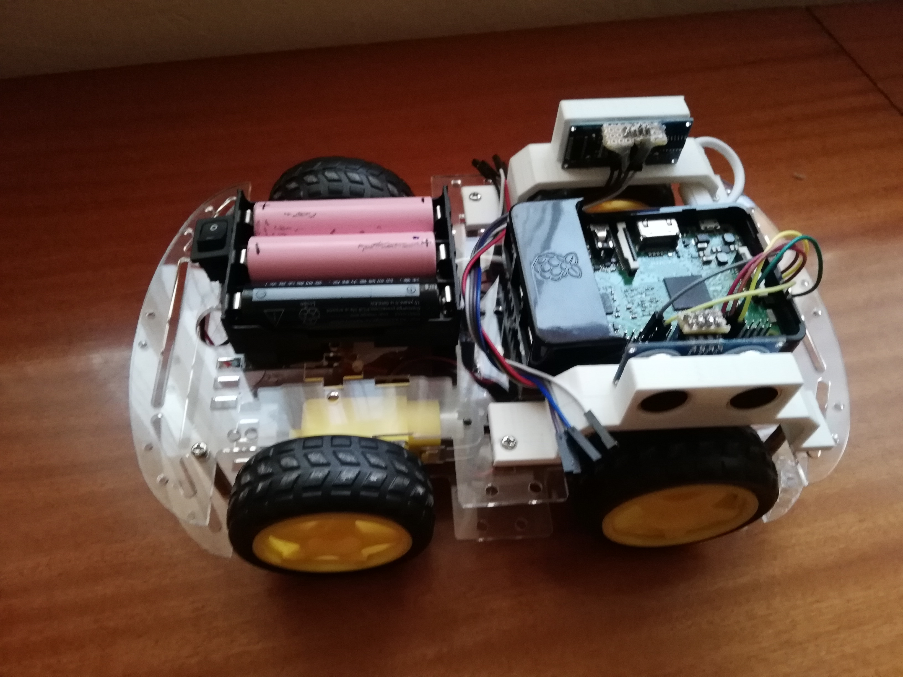

# Raspberry-Pi-car
Rpi car using L298n H-bridge.
You can either drive the car with your keyboard over ssh or you can download an app and drive the car over Bluetooth.

In this case battery pack was made from 3 Li-ion cells (18650 batteries) connected in series, outputing around 12V together. 12V were directly attached to Vin pin of the L298 module, and also buck-converter was used to provide stable 5V (5.08 to be precise) to the Raspberry. It's worth to mention that buck converter's output should be calibrated to around 5.05 - 5.1 V otherwise Rpi reboots constantly because of inproper voltage. Also, Raspberry was running Raspbian OS.

There are also two 3D printed parts in the front for HC-sr04 sensors so it can be programmed for autonomous driving. Be sure to print one part as it is, and one which is mirrored. That could easily be done in slicer software like "Cura".
This mod is not fully developed, and obviously more sensors are needed.

Pin connections between Raspberry and L298 module

| Name | wiringPi | BCM	  | Physical |
| ---  |:--------:| -----:| --------:| 
| in1  | 0        | 17 	  | 11       |
| in2  | 1  	  | 18 	  | 12       | 
| in3  | 2  	  | 27 	  | 13       | 
| in4  | 3  	  | 22    | 15       |
| enA  | 26 	  | 12    | 32       | 
| enB  | 23 	  | 13    | 33       | 

